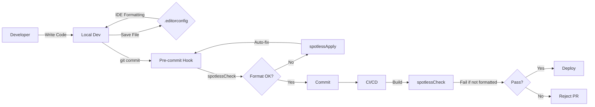
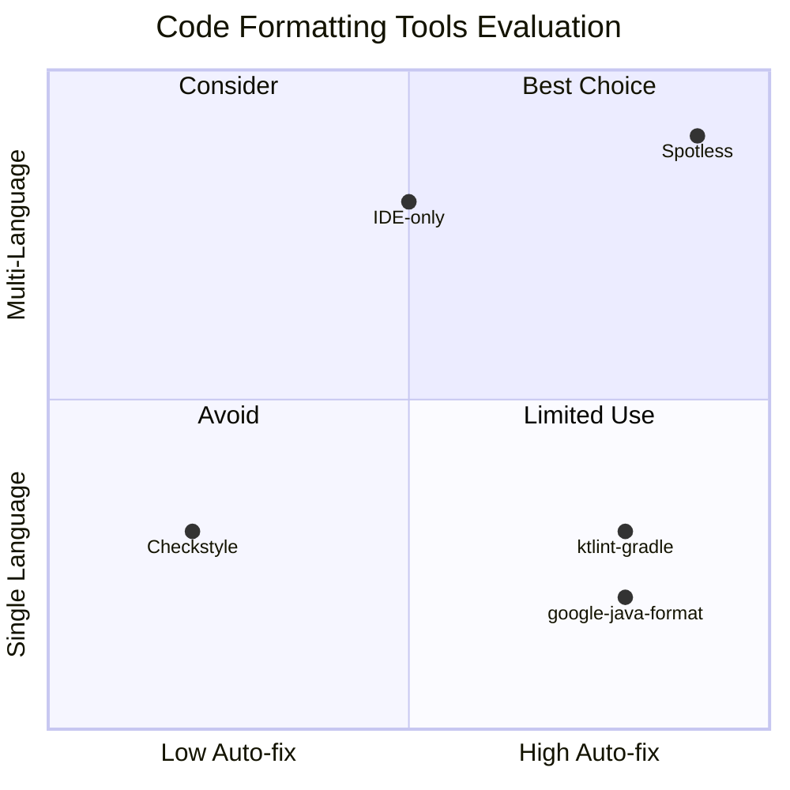

# ADR 001: Spotless Over Checkstyle for Code Formatting

**Status:** Accepted
**Date:** 2025-01-02
**Deciders:** Platform Engineering Team

## Context

We need to enforce consistent code formatting across Java and Kotlin codebases in our Spring Boot applications. The platform convention plugins must provide automatic code formatting that works for both languages, removes unused imports, and can be easily adopted by consumer projects.

## Decision Drivers

- Need to support both Java and Kotlin formatting
- Developers want automatic fixing, not just checking
- Unused imports should be removed automatically
- Formatting should integrate with pre-commit hooks
- Solution should be widely adopted and maintained

## Considered Options

1. **Checkstyle** - Java-only, check-based, no auto-fix
2. **Spotless** - Multi-language, check + auto-fix, plugin ecosystem
3. **ktfmt** - Kotlin-only, Google/Meta style
4. **google-java-format CLI** - Separate tooling per language

## Decision

We chose **Spotless** with `google-java-format` for Java and `ktlint` for Kotlin.

### Positive Consequences

- ✅ **Unified tooling** - One Gradle plugin for both Java and Kotlin
- ✅ **Auto-fix capability** - `spotlessApply` fixes issues automatically
- ✅ **Removes unused imports** - Eliminates manual cleanup
- ✅ **IDE-independent** - Works in any environment
- ✅ **Build integration** - Can enforce in CI/CD pipeline
- ✅ **Active community** - Well-maintained, frequent updates
- ✅ **Flexible configuration** - Can customize per language

### Negative Consequences

- ⚠️ **Additional dependency** - One more Gradle plugin
- ⚠️ **Build time impact** - Adds ~2-5s to build (acceptable)
- ⚠️ **Learning curve** - Developers need to learn `spotlessApply`

## Implementation Details

### Java Formatting
```kotlin
java {
    googleJavaFormat("1.31.0")
    removeUnusedImports()
    importOrder()
    trimTrailingWhitespace()
    endWithNewline()
}
```

### Kotlin Formatting
```kotlin
kotlin {
    ktlint("1.7.1")
        .editorConfigOverride(mapOf(
            "indent_size" to "4",
            "max_line_length" to "120",
            "ij_kotlin_allow_trailing_comma" to "true",
            "ij_kotlin_allow_trailing_comma_on_call_site" to "true"
        ))
    trimTrailingWhitespace()
    endWithNewline()
}
```

### Workflow Integration



## Alternatives Considered

### Option 1: Checkstyle + ktlint Gradle Plugin
- **Pros**: Checkstyle is widely known, separate tools for each language
- **Cons**: Two separate tools, no auto-fix for Java, different config patterns, inconsistent workflow
- **Rejection Reason**: Inconsistent developer experience across languages

### Option 2: Use IDE-based formatting only
- **Pros**: Zero build dependencies
- **Cons**: No enforcement, relies on developer discipline, IDE-specific
- **Rejection Reason**: Cannot enforce consistency across teams

### Option 3: Separate CLI tools (google-java-format + ktlint CLI)
- **Pros**: Maximum flexibility
- **Cons**: Complex CI/CD setup, harder to enforce locally
- **Rejection Reason**: Poor developer experience

## Validation

We validated this decision by:
1. Testing on 3 sample projects (Java, Kotlin, mixed)
2. Measuring build time impact (<5s increase)
3. Developer feedback during trial period (positive)
4. Checking community adoption (50k+ GitHub stars)

## Tool Comparison



## Integration Points

### 1. Build System
```bash
# Check formatting
./gradlew spotlessCheck

# Fix formatting
./gradlew spotlessApply
```

### 2. Pre-commit Hooks
```yaml
# .pre-commit-config.yaml
- repo: local
  hooks:
    - id: ktlint-format
      name: ktlint format
      entry: .githooks/ktlint-format.sh
      language: system
      files: \.kt(s)?$
```

### 3. CI/CD Pipeline
```yaml
# GitHub Actions example
- name: Check code formatting
  run: ./gradlew spotlessCheck
```

### 4. IDE Integration
```ini
# .editorconfig
[*.{kt,kts}]
indent_size = 4
max_line_length = 120
ij_kotlin_allow_trailing_comma = true
ij_kotlin_allow_trailing_comma_on_call_site = true
```

## Migration Path

For existing projects adopting this convention:

1. **Initial Format**: Run `./gradlew spotlessApply` on entire codebase
2. **Commit**: Create a single "chore: apply spotless formatting" commit
3. **Enable Checks**: Add `spotlessCheck` to CI pipeline
4. **Developer Setup**: Update developer documentation

## References

- [Spotless GitHub](https://github.com/diffplug/spotless)
- [google-java-format](https://github.com/google/google-java-format)
- [ktlint](https://github.com/pinterest/ktlint)
- [Why Spotless?](https://github.com/diffplug/spotless/blob/main/PADDEDCELL.md)

## Notes

This decision was influenced by our need to support both Java and Kotlin in Spring Boot projects. The unified Gradle plugin approach significantly simplifies our build configuration and developer workflow.
