# Plugin Composition Architecture

This document visualizes how our Gradle convention plugins compose together to provide layered functionality.

## Plugin Dependency Graph

## Detailed Plugin Stack

## Plugin Responsibilities

## Build Lifecycle Flow

```mermaid
%%{init: {'theme':'dark'}%%
sequenceDiagram
    participant Dev as Developer
    participant Gradle as Gradle Build
    participant Java as JavaConventionsPlugin
    participant Spotless as Spotless Plugin
    participant Test as Test Tasks
    participant JaCoCo as JaCoCo Plugin
    Dev ->> Gradle: ./gradlew build
    Gradle ->> Java: Apply java-conventions
    Java ->> Spotless: Configure formatting
    Java ->> JaCoCo: Configure coverage
    Gradle ->> Spotless: spotlessCheck
    Spotless -->> Gradle: ✓ Formatting OK
    Gradle ->> Test: Run tests
    Test -->> JaCoCo: Collect coverage
    JaCoCo -->> Gradle: Generate reports
    Gradle -->> Dev: Build Success
    Gradle -->> Dev: Coverage: 85%
```

## Configuration Propagation

## Version Management Flow

## Key Design Principles

### 1. Layered Composition
Plugins build on each other incrementally:
- **Base Layer**: Java tooling (java-conventions)
- **Framework Layer**: Spring Boot (spring-core-conventions)
- **Application Layer**: Web/WebFlux (specific implementations)

### 2. Single Responsibility
Each plugin has a focused purpose:
- `java-conventions`: Code quality + toolchain
- `spring-test-conventions`: Testing only
- `spring-core-conventions`: Spring Boot integration
- `spring-web-conventions`: Web-specific dependencies

### 3. Convention Over Configuration
Sensible defaults with escape hatches:
- Pre-configured but customizable
- Centralized version management
- Standard repository configuration

### 4. Fail-Fast Philosophy
Catch issues early:
- Spotless fails build on formatting issues
- Strict dependency resolution fails on conflicts
- JaCoCo generates reports automatically
